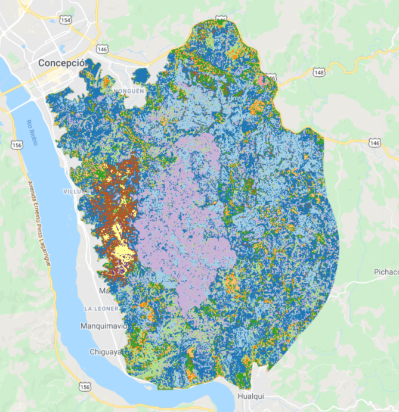
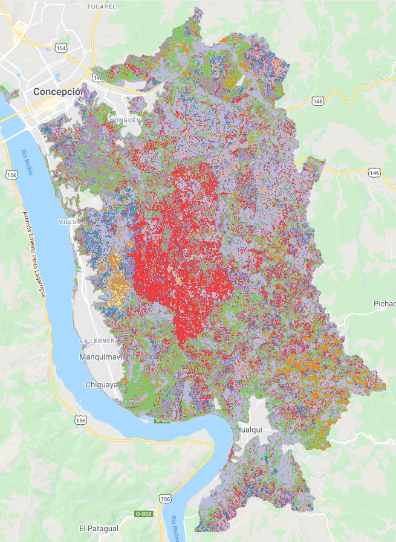

# Nonguen-GE

El siguiente repositorio tiene como finalidad compartir el código de generación de reclasificación
de coberturas de suelo para el Parque Nacional Nonguén -Concepción, Chile. El proceso se irá constantemente
actualizando a medida que se afinen los puntos para entrenar las firmas espectrales.

## Herramientas y métodos

El código estará escrito en *javascript* y se ejecutará en la consola que dispone *GEE* y, por lo último, al no poder acceder 
a las variables que se almacenan en dicha consola, se tomará un pantallazo de las variables para afinar tratamientos de dudas 
posterior al respecto de qué significa cada variable.

El archivo [1-intro.js](https://github.com/demcortillas/Nonguen-GE/blob/main/1-intro.js) consiste en una introducción a lo básico de  *js*
 que incluye los tipos de datos, los objetos, métodos de string, métodos de arrays, composición de funciones, operadores lógicos, loops y un otras cosas
básicas para el manejo del programa. Si bien *GEE* tiene su propia manera de interactuar un poco diferente a una consola de *js*, siempre pueden ser útiles
las sentencias básicas para el mejor manejo del código.

El archivo [2-reclass_nonguen.js](https://github.com/demcortillas/Nonguen-GE/blob/main/2-reclass_nonguen.js) contiene las sentencias ocupadas
para realizar el proceso reclasificatorio mediante el método *random forest*, y es este script en conjunto con las variables globales de la consola (que no podemos acceder
pero que podemos ver su pantallazo) lo que nos llevará al resultado final.

El archivo [3-reclass_nonguen.js](https://github.com/demcortillas/Nonguen-GE/blob/main/3-reclass_nonguen.js) consiste en el último script desarrollado para hacer la claificación de coberturas de suelo al igual que el script anterior.

El archivo [script.R](https://github.com/demcortillas/Nonguen-GE/blob/main/delineated-basin/script.R) fue escrito para realizar la clasificación de cuencas hidrográficas mediante el paquetes `raster`,`rgrass7` y `rgdal` a partir de la imagen `srtm` que se encuentra [aquí](https://github.com/demcortillas/Nonguen-GE/blob/main/delineated-basin/Mosaic.tif)

## Clasificación de coberturas de suelo

### Aproximación 1:

Esta estimación se realiza como forma experimental mediante un buffer de 5km al rededor del límite de la reserva

Click [aquí](https://github.com/demcortillas/Nonguen-GE/tree/main/data_vectorial/Limites/ONGDA) para descargar el poligono `.shp` utilizado de limite
Para descargar la imagen en formato *Geotiff* [click aquí](https://drive.google.com/file/d/1s3pQFgFP17JjhZU2eG-B7VdR7W3xF7Lv/view?usp=sharing) 

### Aproximación 2:

Delimitación por cuencas aledañas de la reserva nonguen esta se realiza mediante la delimitación de las cuencas hidrográficas aledañas al parque Nonguén.
Se realiza a partir de una imagen srt (click [aquí](https://github.com/demcortillas/Nonguen-GE/blob/main/delineated-basin/Mosaic.tif) para descargarla) y mediante un proceso de delimitación de cuencas que se describe [en esta carpeta](https://github.com/demcortillas/Nonguen-GE/tree/main/delineated-basin)

Click [aquí](https://github.com/demcortillas/Nonguen-GE/tree/main/data_vectorial/Limites/CUENCAS) para descargar el polígono `.shp` utilizado como límite con nombre *CUENCA4*
Para descargar la imagen en formato *Geotiff* [click aquí](https://drive.google.com/file/d/1MBDi7JnzcvyaS6PkBwMytO258BxFfRWf/view?usp=sharing) 

Para consultas y/o aportes en el proceso contactar a este correo: diegmedina@udec.cl
Para descargar la cartografía en formato `.pdf` click [aquí](https://github.com/demcortillas/Nonguen-GE/blob/main/CARTOS/CARTO1.pdf)